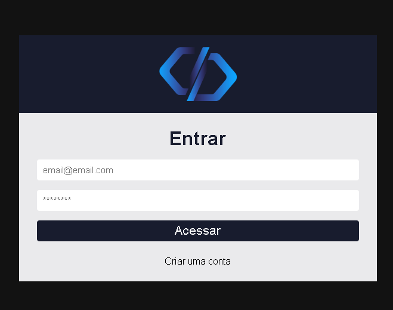
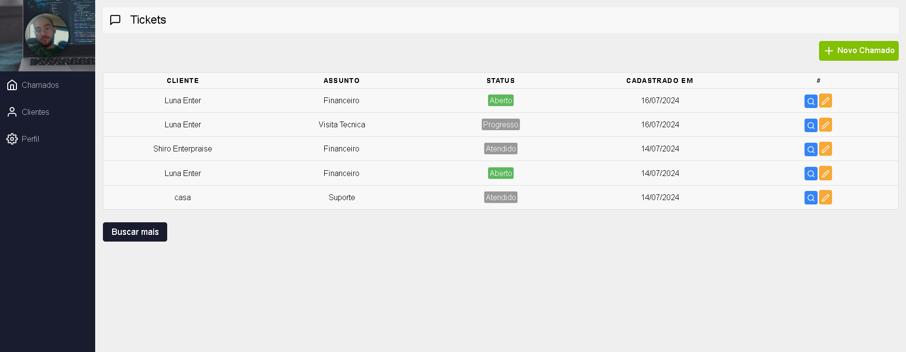
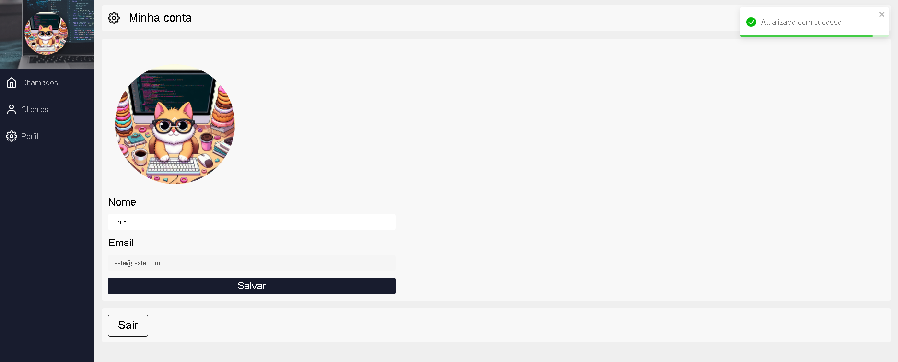
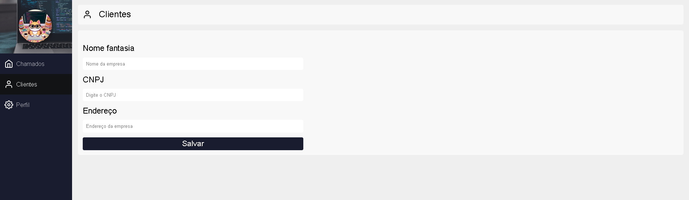

# 💻 Sistema de Cadastro de Chamados

## Descrição 
Este é um projeto de sistema de cadastro de chamados desenvolvido com React e Firebase. O sistema permite a criação, visualização, atualização e exclusão de chamados, além de contar com autenticação segura para os usuários.

## Funcionalidades
- **Autenticação de Usuários:** Implementada usando Firebase Authentication, proporcionando uma experiência segura e confiável para os usuários.
- **Operações CRUD:** Permite a criação, leitura, atualização e exclusão de chamados.
- **Integração com Firebase Firestore:** Utilizado para armazenamento e gerenciamento em tempo real dos dados dos chamados.
- **Interface Amigável:** Desenvolvida com React, garantindo uma experiência de usuário fluida e responsiva.

## 🚀 Tecnologias Utilizadas
- **React:** Biblioteca JavaScript para construção de interfaces de usuário.
- **Firebase Authentication:** Serviço de autenticação do Firebase.
- **Firebase Firestore:** Banco de dados NoSQL em tempo real do Firebase.
- **CSS:** Estilização da interface do usuário.

## Imagens do Projeto

  
   
  
   
  
   
  

## Licença
Este projeto está licenciado sob a Licença MIT. Veja o arquivo LICENSE para mais detalhes.